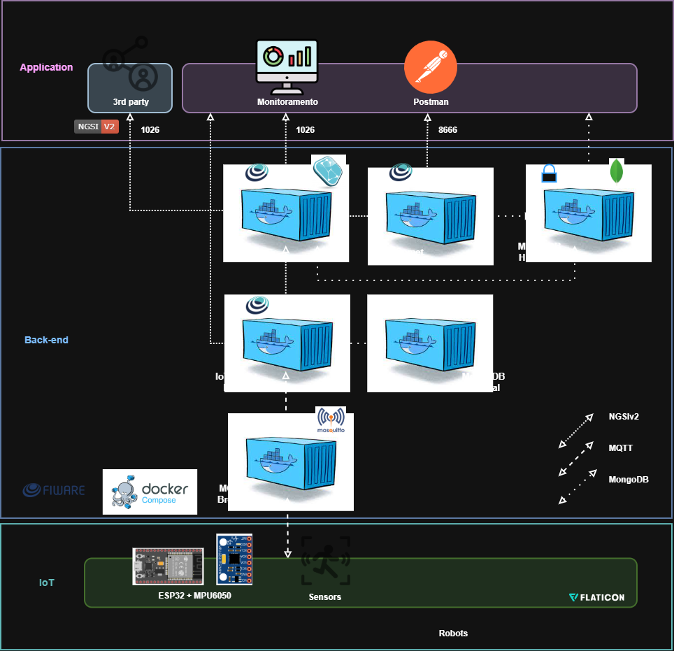

# 👟 CareStep - Monitoramento Inteligente de Passos

## 📌 Descrição do Projeto

O **CareStep** é uma solução baseada em Internet das Coisas voltada ao monitoramento da atividade física, capaz de identificar e registrar automaticamente a quantidade de passos realizados pelo usuário.

O sistema foi desenvolvido para auxiliar no acompanhamento de hábitos saudáveis, promovendo o monitoramento contínuo da movimentação e disponibilizando as informações coletadas para visualização remota.

A solução utiliza um **ESP32** integrado ao sensor **MPU6050**, responsável pela captura dos dados de aceleração. Essas informações são processadas localmente para detecção dos passos e enviadas para a plataforma **FIWARE Orion Context Broker** por meio de requisições HTTP.

Além da versão física, o projeto também conta com uma **simulação completa no Wokwi**, permitindo demonstrar todas as funcionalidades do sistema em ambiente virtual.

---

# 🧠 Arquitetura da Solução



A arquitetura do CareStep integra sensores, processamento embarcado, comunicação em rede e visualização dos dados por meio de dashboards.

Fluxo de funcionamento:

```text
MPU6050 → ESP32 → Wi-Fi → FIWARE Orion → Dashboard Python
```

---

# ⚙️ Tecnologias Utilizadas

* ESP32
* MPU6050 (Acelerômetro)
* Wokwi (Simulação)
* FIWARE Orion Context Broker
* HTTP
* Python
* STH-Comet
* Matplotlib
* Requests
* Postman

---

# 🔌 Dispositivo IoT

O CareStep foi concebido para aplicações vestíveis, podendo ser integrado ao tênis para monitoramento contínuo da atividade física.

## Funcionalidades do dispositivo

* 👣 Contagem automática de passos;
* 🏃 Cálculo da intensidade do movimento;
* 🔋 Monitoramento do nível da bateria;
* 📶 Comunicação Wi-Fi;
* ☁️ Integração com o ecossistema FIWARE.

---

# 🔬 Funcionamento

O dispositivo realiza:

1. Leitura dos dados de aceleração nos eixos X, Y e Z;
2. Cálculo da magnitude da aceleração;
3. Remoção do efeito da gravidade;
4. Aplicação de limiares para redução de ruídos;
5. Detecção automática dos passos;
6. Monitoramento do nível da bateria;
7. Envio periódico dos dados ao FIWARE Orion.

---

# 🧪 Simulação no Wokwi

Para validação do funcionamento do sistema, foi desenvolvida uma simulação utilizando a plataforma **Wokwi**.

A simulação utiliza:

* ESP32;
* Sensor MPU6050;
* Potenciômetro para simulação da bateria;
* LED indicador de bateria baixa.

A plataforma possibilitou demonstrar a aquisição dos dados, a detecção dos passos e a integração com o FIWARE sem a necessidade do hardware físico.

---

# ☁️ Integração com FIWARE

Os dados coletados são enviados para o **FIWARE Orion Context Broker** a cada **10 segundos**.

## Entidade utilizada

```json
{
    "id": "urn:ngsi-ld:StepMonitor:tenis001",
    "type": "StepMonitor"
}
```

## Atributos monitorados

```text
steps
battery
accelX
accelY
accelZ
intensity
status
```

---

# 📊 Dashboard Inteligente

O CareStep conta com um **dashboard desenvolvido em Python**, responsável por consultar automaticamente os dados armazenados no FIWARE e apresentá-los de forma clara e intuitiva.

O dashboard realiza atualizações automáticas a cada **10 segundos**, permitindo o acompanhamento em tempo real da atividade física do usuário.

## Indicadores monitorados

* 👣 Quantidade de passos;
* 🏃 Intensidade do movimento;
* 🔋 Nível da bateria.

Além dos valores atuais, o dashboard também apresenta gráficos históricos e estatísticas simples, como médias dos registros coletados.

---

# 🖥️ Tecnologias do Dashboard

* Python;
* Requests;
* Matplotlib;
* IPython Display.

---

# 📈 Consulta de Dados

## Estado Atual (Orion)

```http
GET /v2/entities
```

---

## Histórico (STH-Comet)

```http
GET /STH/v1/contextEntities/type/StepMonitor/id/urn:ngsi-ld:StepMonitor:tenis001/attributes/steps
```

---

# 👥 Equipe

## 404 Girls Not Found

| Integrante                      | RM     |
| ------------------------------- | ------ |
| Giovanna Oliveira Ferreira Dias | 566647 |
| Maria Laura Druzeic             | 566634 |
| Marianne Mukai Nishikawa        | 568001 |

**Turma:** 1ESPA

---

# 🎯 Objetivo do Projeto

Demonstrar como soluções baseadas em Internet das Coisas podem contribuir para o monitoramento da saúde e para a promoção de hábitos mais saudáveis, integrando sensores, processamento embarcado, plataformas IoT e ferramentas de visualização de dados.

---

# 📄 Licença

Projeto desenvolvido para fins acadêmicos.
